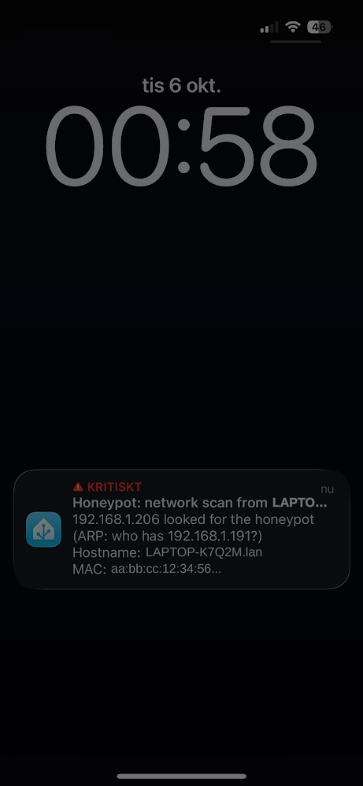

<p align="center">
  
</p>

<p align="center">
  <a href="https://my.home-assistant.io/redirect/supervisor_add_addon_repository/?repository_url=https%3A%2F%2Fgithub.com%2Frangsjo%2Fha_honeypot"></a>
</p>

<p align="center">
  <a href="https://github.com/rangsjo/ha_honeypot/actions/workflows/ci.yaml"></a>
  <a href="https://github.com/rangsjo/ha_honeypot/releases"></a>
  
  <a href="LICENSE"></a>
  <a href="https://buymeacoffee.com/jojononasos"></a>
</p>



**A fake NAS on your network that tells you when someone is looking around.**

Your router's firewall guards the connection to the internet. It doesn't see what happens *between* devices at home: a hacked smart plug, a laptop with malware, or a guest on the Wi-Fi exploring what else is there. Inside a home network, an intruder is usually free to scan and try passwords unnoticed.

A honeypot turns that around. It's a device that **no one has any legitimate reason to contact**, so it needs no tuning and has no "normal" traffic to learn. Anything that touches it is a real signal, not a guess.

**How it works.** The add-on adds a convincing fake file server to your LAN. It has its own IP and MAC address, a random hostname, and OS banners that differ on every install. It offers SSH, Telnet, FTP, web, MQTT and SMB logins that never let anyone in. When a device scans for it, connects, or tries a password, you get a notification on your phone that says **which device** it was: its name in HA, its hostname, its manufacturer, what it tried, and how often.

**Why it's effective**
- **Early warning:** scanners look for live addresses before probing ports, and the honeypot notices that first step.
- **Rare false alarms:** the only legitimate visitor is your router, and it's ignored. Your own tools can be silenced with one tap.
- **Actionable alerts:** you learn *which* device to unplug, not just that "something happened".
- **Harmless to run:** it never accepts a login or runs a command, and it drops all privileges after startup.

**Limitations**
- **Only catches what touches it.** An attacker who only listens, or goes straight for one known device, won't be caught.
- **Detects, doesn't block.** It tells you about an intruder but doesn't stop them.
- **Own IP needs Ethernet,** or a VM adapter that allows extra MAC addresses. Otherwise it falls back to sharing HA's IP, which is easier to recognise.
- **Elevated rights at startup.** It needs `NET_ADMIN` and `SYS_ADMIN` to create its network identity, so HA shows a lower security rating.

<br clear="right">

## Install

1. Click **Add repository** above, or add `https://github.com/rangsjo/ha_honeypot` under **Settings → Add-ons → Add-on Store → ⋮ → Repositories**.
2. Install **Honeypot**. In **Configuration**, add your phone under **Notify targets** (e.g. `notify.mobile_app_my_phone`).
3. Start it. The **Honeypot** panel shows its IP, and **Send test notification** checks the alert path.

Needs Home Assistant OS or Supervised (HACS can't install add-ons). Options, entities and troubleshooting are in the [documentation](honeypot/DOCS.md), which also appears as the add-on's Documentation tab.

## What it offers

| | |
|---|---|
| **Bait** | SSH · Telnet · FTP · HTTP login page · MQTT broker · SMB share · RDP/VNC/MySQL tripwires |
| **Detects** | Network scans (ARP/ping sweeps) · connections · every username and password tried |
| **Identifies** | HA device name · DNS/mDNS/NetBIOS hostname · MAC vendor · the intruder's open ports |
| **Disguise** | Own IP and MAC via DHCP · random per-install persona · announced over mDNS like a real NAS |
| **Alerts** | Phone notifications (optionally critical, so they sound on silent) · *Ignore this device* button · one alert per device, not fifty |
| **In HA** | `binary_sensor.honeypot_intrusion` · last intruder · events today · `honeypot_alert` event for automations · panel with 14-day history |

## Development

```bash
python3 -m venv .venv && .venv/bin/pip install -r requirements-test.txt
.venv/bin/pytest
```

- **Without HA:** `docker compose up -d --build` runs it standalone; see `docker-compose.yaml`.
- **On your own HA:** `./sync-to-ha.sh` installs your working copy as a local add-on (needs the SSH add-on).
- **Releasing:** bump `version` in `honeypot/config.json` and add a `CHANGELOG.md` entry. On push, CI builds the images on GHCR and tags a GitHub release.

<details>
<summary>Project layout</summary>

```
honeypot/                add-on (Docker build context)
  config.json            manifest: options, privileges, ingress
  DOCS.md, CHANGELOG.md, translations/   shown in the HA store
  main.py                startup: persona, own IP, services, panel, alerts
  netns.py               own IP: macvlan + private network namespace + DHCP
  persona.py             random per-install identity
  privileges.py          drops root and all capabilities after startup
  services/              ssh, telnet, ftp, http, mqtt, smb, tripwire, discovery
  enrich.py              device identification
  notifier.py, channels.py, entities.py, ha_api.py   alerts and HA integration
  mdns.py, stats.py, ui.py, templates/              announcement and panel
tests/                   unit and end-to-end tests
```

</details>

## Support

Found a bug or have an idea? [Open an issue](https://github.com/rangsjo/ha_honeypot/issues). Security problems: please report them [privately](https://github.com/rangsjo/ha_honeypot/security/advisories/new).

If the honeypot caught something on your network, you can [buy me a coffee](https://buymeacoffee.com/jojononasos). ☕

MIT licensed.
